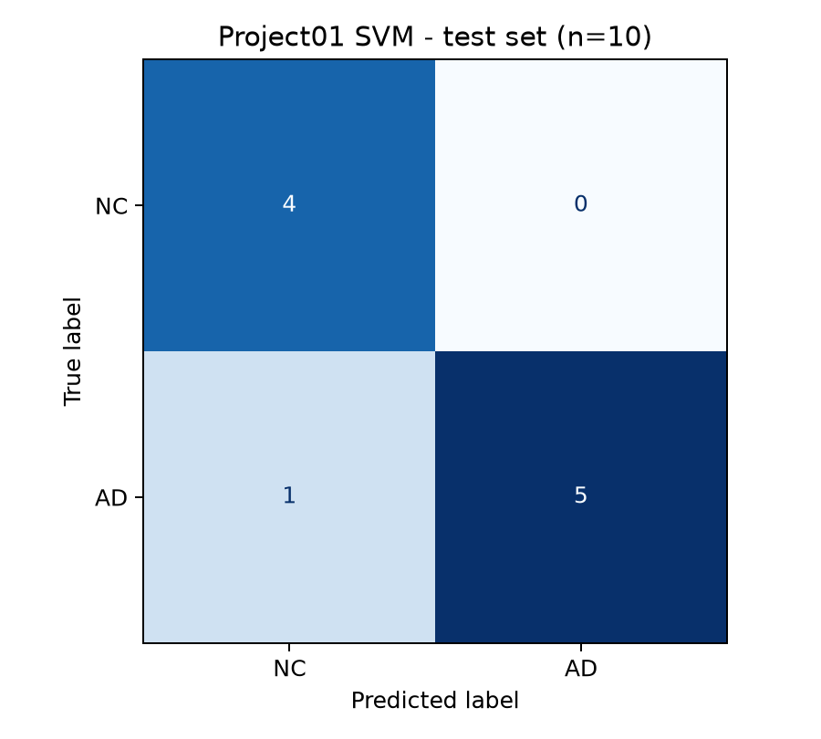

# Verified run results

[English](RUN_RESULTS.md) · [中文版](运行结果说明.md)

The model uses the agreed 90 regional grey-matter volumes, with 40 training subjects and 10 test subjects. The fixed baseline is `StandardScaler + RBF SVM` (C=1, gamma='scale'). No parameters were tuned using test labels.

| Metric | Result |
| --- | --- |
| Training class counts | NC 21 / AD 19 |
| Training accuracy | 100.0% (training fit, not test performance) |
| Training-only five-fold CV mean accuracy | 97.5% |
| CV fold accuracy standard deviation | 5.0 percentage points |
| Individual CV fold accuracies | 100%, 100%, 100%, 87.5%, 100% |
| Final test accuracy | 90.0%, or 9/10 correct |
| AD sensitivity | 83.3% (5/6) |
| NC specificity | 100.0% (4/4) |

The confusion matrix has true classes as rows and predicted classes as columns, both ordered NC / AD: `[[4, 0], [1, 5]]`.

| FileName | Prediction | Supplied true label | Correct |
| --- | --- | --- | --- |
| Data_40.nii | NC | NC | True |
| Data_41.nii | NC | NC | True |
| Data_42.nii | AD | AD | True |
| Data_43.nii | NC | NC | True |
| Data_44.nii | AD | AD | True |
| Data_45.nii | NC | NC | True |
| Data_46.nii | AD | AD | True |
| Data_47.nii | AD | AD | True |
| Data_48.nii | AD | AD | True |
| Data_49.nii | NC | AD | False |

Use **Prediction** from [test_predictions.csv](results/test_predictions.csv) in the report. True labels above are included only for final comparison. Data_49 is the sole error: predicted NC, supplied label AD. Its cause has not been established.

The notebook was executed from top to bottom and checked against the CLI. Label alignment, the scaler's training-only sample range, model saving/reloading, invalid-input rejection, and independence from test labels were verified. See [code verification](results/code_verification.json), [training record](results/training_record.json), [test metrics](results/test_metrics.json), and [prediction/label comparison](results/test_evaluation.csv).

These are results from a fixed baseline on a small dataset. They do not prove that the chosen SVM parameters are optimal. Data_44 retains the agreed BET result and its quality limitations in the [processing QC records](submission/processing_qc_records.csv). With only 10 test subjects, one error changes accuracy by 10 percentage points.

Related pages: [English home](README.md), [English running guide](RUNNING_GUIDE.md), [English report evidence index](report_evidence/README.md).
