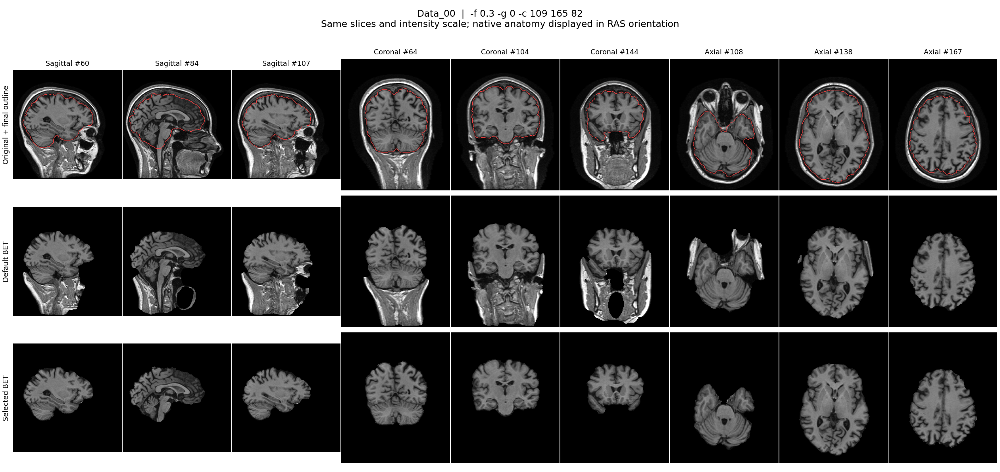
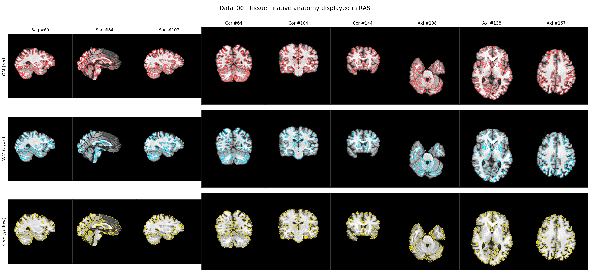
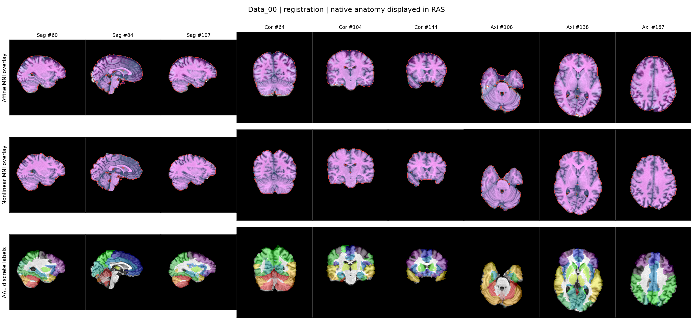
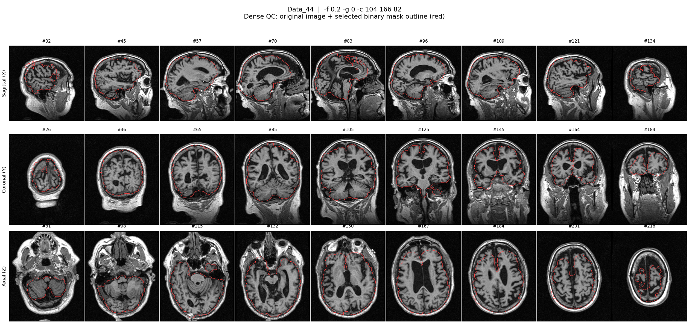

# Preprocessing image gallery

[English](README.md) · [中文版](README_zh-CN.md)

All 50 subjects have uploaded preprocessing PNGs: 100 BET figures and 100 tissue/registration figures. This gallery links directly to every figure. Representative images are also included in this folder and embedded below. The full-resolution subject figures are stored in `report_evidence/`.

## Representative images

### BET brain extraction: Data_00

Rows show the original image with the selected mask boundary, default BET, and selected-parameter BET.

### FAST tissue segmentation: Data_00

Rows show GM (red), WM (cyan), and CSF (yellow) binary-mask boundaries.

### Registration and AAL labels: Data_00

Rows show the affine template, nonlinear template, and discrete AAL-label overlay in the subject's native space.

### Documented BET limitation: Data_44

The retained result has suspected frontal tissue omission and residual non-brain tissue. These are recorded limitations of the final dataset.

## All subjects

Click a PNG link to preview it on GitHub. After downloading the repository, the [BET browser](../../report_evidence/bet/index.html) and [tissue/registration browser](../../report_evidence/tissue_registration/index.html) allow offline subject selection. GitHub's HTML file view does not run these browsers.

| Subject | Split | BET comparison | BET 27-slice mask | FAST tissue masks | Registration / AAL |
| --- | --- | --- | --- | --- | --- |
| Data_00 | train | [Comparison](../../report_evidence/bet/images/Data_00_comparison.png) | [Mask](../../report_evidence/bet/images/Data_00_dense.png) | [Tissues](../../report_evidence/tissue_registration/Data_00_tissue.png) | [Registration](../../report_evidence/tissue_registration/Data_00_registration.png) |
| Data_01 | train | [Comparison](../../report_evidence/bet/images/Data_01_comparison.png) | [Mask](../../report_evidence/bet/images/Data_01_dense.png) | [Tissues](../../report_evidence/tissue_registration/Data_01_tissue.png) | [Registration](../../report_evidence/tissue_registration/Data_01_registration.png) |
| Data_02 | train | [Comparison](../../report_evidence/bet/images/Data_02_comparison.png) | [Mask](../../report_evidence/bet/images/Data_02_dense.png) | [Tissues](../../report_evidence/tissue_registration/Data_02_tissue.png) | [Registration](../../report_evidence/tissue_registration/Data_02_registration.png) |
| Data_03 | train | [Comparison](../../report_evidence/bet/images/Data_03_comparison.png) | [Mask](../../report_evidence/bet/images/Data_03_dense.png) | [Tissues](../../report_evidence/tissue_registration/Data_03_tissue.png) | [Registration](../../report_evidence/tissue_registration/Data_03_registration.png) |
| Data_04 | train | [Comparison](../../report_evidence/bet/images/Data_04_comparison.png) | [Mask](../../report_evidence/bet/images/Data_04_dense.png) | [Tissues](../../report_evidence/tissue_registration/Data_04_tissue.png) | [Registration](../../report_evidence/tissue_registration/Data_04_registration.png) |
| Data_05 | train | [Comparison](../../report_evidence/bet/images/Data_05_comparison.png) | [Mask](../../report_evidence/bet/images/Data_05_dense.png) | [Tissues](../../report_evidence/tissue_registration/Data_05_tissue.png) | [Registration](../../report_evidence/tissue_registration/Data_05_registration.png) |
| Data_06 | train | [Comparison](../../report_evidence/bet/images/Data_06_comparison.png) | [Mask](../../report_evidence/bet/images/Data_06_dense.png) | [Tissues](../../report_evidence/tissue_registration/Data_06_tissue.png) | [Registration](../../report_evidence/tissue_registration/Data_06_registration.png) |
| Data_07 | train | [Comparison](../../report_evidence/bet/images/Data_07_comparison.png) | [Mask](../../report_evidence/bet/images/Data_07_dense.png) | [Tissues](../../report_evidence/tissue_registration/Data_07_tissue.png) | [Registration](../../report_evidence/tissue_registration/Data_07_registration.png) |
| Data_08 | train | [Comparison](../../report_evidence/bet/images/Data_08_comparison.png) | [Mask](../../report_evidence/bet/images/Data_08_dense.png) | [Tissues](../../report_evidence/tissue_registration/Data_08_tissue.png) | [Registration](../../report_evidence/tissue_registration/Data_08_registration.png) |
| Data_09 | train | [Comparison](../../report_evidence/bet/images/Data_09_comparison.png) | [Mask](../../report_evidence/bet/images/Data_09_dense.png) | [Tissues](../../report_evidence/tissue_registration/Data_09_tissue.png) | [Registration](../../report_evidence/tissue_registration/Data_09_registration.png) |
| Data_10 | train | [Comparison](../../report_evidence/bet/images/Data_10_comparison.png) | [Mask](../../report_evidence/bet/images/Data_10_dense.png) | [Tissues](../../report_evidence/tissue_registration/Data_10_tissue.png) | [Registration](../../report_evidence/tissue_registration/Data_10_registration.png) |
| Data_11 | train | [Comparison](../../report_evidence/bet/images/Data_11_comparison.png) | [Mask](../../report_evidence/bet/images/Data_11_dense.png) | [Tissues](../../report_evidence/tissue_registration/Data_11_tissue.png) | [Registration](../../report_evidence/tissue_registration/Data_11_registration.png) |
| Data_12 | train | [Comparison](../../report_evidence/bet/images/Data_12_comparison.png) | [Mask](../../report_evidence/bet/images/Data_12_dense.png) | [Tissues](../../report_evidence/tissue_registration/Data_12_tissue.png) | [Registration](../../report_evidence/tissue_registration/Data_12_registration.png) |
| Data_13 | train | [Comparison](../../report_evidence/bet/images/Data_13_comparison.png) | [Mask](../../report_evidence/bet/images/Data_13_dense.png) | [Tissues](../../report_evidence/tissue_registration/Data_13_tissue.png) | [Registration](../../report_evidence/tissue_registration/Data_13_registration.png) |
| Data_14 | train | [Comparison](../../report_evidence/bet/images/Data_14_comparison.png) | [Mask](../../report_evidence/bet/images/Data_14_dense.png) | [Tissues](../../report_evidence/tissue_registration/Data_14_tissue.png) | [Registration](../../report_evidence/tissue_registration/Data_14_registration.png) |
| Data_15 | train | [Comparison](../../report_evidence/bet/images/Data_15_comparison.png) | [Mask](../../report_evidence/bet/images/Data_15_dense.png) | [Tissues](../../report_evidence/tissue_registration/Data_15_tissue.png) | [Registration](../../report_evidence/tissue_registration/Data_15_registration.png) |
| Data_16 | train | [Comparison](../../report_evidence/bet/images/Data_16_comparison.png) | [Mask](../../report_evidence/bet/images/Data_16_dense.png) | [Tissues](../../report_evidence/tissue_registration/Data_16_tissue.png) | [Registration](../../report_evidence/tissue_registration/Data_16_registration.png) |
| Data_17 | train | [Comparison](../../report_evidence/bet/images/Data_17_comparison.png) | [Mask](../../report_evidence/bet/images/Data_17_dense.png) | [Tissues](../../report_evidence/tissue_registration/Data_17_tissue.png) | [Registration](../../report_evidence/tissue_registration/Data_17_registration.png) |
| Data_18 | train | [Comparison](../../report_evidence/bet/images/Data_18_comparison.png) | [Mask](../../report_evidence/bet/images/Data_18_dense.png) | [Tissues](../../report_evidence/tissue_registration/Data_18_tissue.png) | [Registration](../../report_evidence/tissue_registration/Data_18_registration.png) |
| Data_19 | train | [Comparison](../../report_evidence/bet/images/Data_19_comparison.png) | [Mask](../../report_evidence/bet/images/Data_19_dense.png) | [Tissues](../../report_evidence/tissue_registration/Data_19_tissue.png) | [Registration](../../report_evidence/tissue_registration/Data_19_registration.png) |
| Data_20 | train | [Comparison](../../report_evidence/bet/images/Data_20_comparison.png) | [Mask](../../report_evidence/bet/images/Data_20_dense.png) | [Tissues](../../report_evidence/tissue_registration/Data_20_tissue.png) | [Registration](../../report_evidence/tissue_registration/Data_20_registration.png) |
| Data_21 | train | [Comparison](../../report_evidence/bet/images/Data_21_comparison.png) | [Mask](../../report_evidence/bet/images/Data_21_dense.png) | [Tissues](../../report_evidence/tissue_registration/Data_21_tissue.png) | [Registration](../../report_evidence/tissue_registration/Data_21_registration.png) |
| Data_22 | train | [Comparison](../../report_evidence/bet/images/Data_22_comparison.png) | [Mask](../../report_evidence/bet/images/Data_22_dense.png) | [Tissues](../../report_evidence/tissue_registration/Data_22_tissue.png) | [Registration](../../report_evidence/tissue_registration/Data_22_registration.png) |
| Data_23 | train | [Comparison](../../report_evidence/bet/images/Data_23_comparison.png) | [Mask](../../report_evidence/bet/images/Data_23_dense.png) | [Tissues](../../report_evidence/tissue_registration/Data_23_tissue.png) | [Registration](../../report_evidence/tissue_registration/Data_23_registration.png) |
| Data_24 | train | [Comparison](../../report_evidence/bet/images/Data_24_comparison.png) | [Mask](../../report_evidence/bet/images/Data_24_dense.png) | [Tissues](../../report_evidence/tissue_registration/Data_24_tissue.png) | [Registration](../../report_evidence/tissue_registration/Data_24_registration.png) |
| Data_25 | train | [Comparison](../../report_evidence/bet/images/Data_25_comparison.png) | [Mask](../../report_evidence/bet/images/Data_25_dense.png) | [Tissues](../../report_evidence/tissue_registration/Data_25_tissue.png) | [Registration](../../report_evidence/tissue_registration/Data_25_registration.png) |
| Data_26 | train | [Comparison](../../report_evidence/bet/images/Data_26_comparison.png) | [Mask](../../report_evidence/bet/images/Data_26_dense.png) | [Tissues](../../report_evidence/tissue_registration/Data_26_tissue.png) | [Registration](../../report_evidence/tissue_registration/Data_26_registration.png) |
| Data_27 | train | [Comparison](../../report_evidence/bet/images/Data_27_comparison.png) | [Mask](../../report_evidence/bet/images/Data_27_dense.png) | [Tissues](../../report_evidence/tissue_registration/Data_27_tissue.png) | [Registration](../../report_evidence/tissue_registration/Data_27_registration.png) |
| Data_28 | train | [Comparison](../../report_evidence/bet/images/Data_28_comparison.png) | [Mask](../../report_evidence/bet/images/Data_28_dense.png) | [Tissues](../../report_evidence/tissue_registration/Data_28_tissue.png) | [Registration](../../report_evidence/tissue_registration/Data_28_registration.png) |
| Data_29 | train | [Comparison](../../report_evidence/bet/images/Data_29_comparison.png) | [Mask](../../report_evidence/bet/images/Data_29_dense.png) | [Tissues](../../report_evidence/tissue_registration/Data_29_tissue.png) | [Registration](../../report_evidence/tissue_registration/Data_29_registration.png) |
| Data_30 | train | [Comparison](../../report_evidence/bet/images/Data_30_comparison.png) | [Mask](../../report_evidence/bet/images/Data_30_dense.png) | [Tissues](../../report_evidence/tissue_registration/Data_30_tissue.png) | [Registration](../../report_evidence/tissue_registration/Data_30_registration.png) |
| Data_31 | train | [Comparison](../../report_evidence/bet/images/Data_31_comparison.png) | [Mask](../../report_evidence/bet/images/Data_31_dense.png) | [Tissues](../../report_evidence/tissue_registration/Data_31_tissue.png) | [Registration](../../report_evidence/tissue_registration/Data_31_registration.png) |
| Data_32 | train | [Comparison](../../report_evidence/bet/images/Data_32_comparison.png) | [Mask](../../report_evidence/bet/images/Data_32_dense.png) | [Tissues](../../report_evidence/tissue_registration/Data_32_tissue.png) | [Registration](../../report_evidence/tissue_registration/Data_32_registration.png) |
| Data_33 | train | [Comparison](../../report_evidence/bet/images/Data_33_comparison.png) | [Mask](../../report_evidence/bet/images/Data_33_dense.png) | [Tissues](../../report_evidence/tissue_registration/Data_33_tissue.png) | [Registration](../../report_evidence/tissue_registration/Data_33_registration.png) |
| Data_34 | train | [Comparison](../../report_evidence/bet/images/Data_34_comparison.png) | [Mask](../../report_evidence/bet/images/Data_34_dense.png) | [Tissues](../../report_evidence/tissue_registration/Data_34_tissue.png) | [Registration](../../report_evidence/tissue_registration/Data_34_registration.png) |
| Data_35 | train | [Comparison](../../report_evidence/bet/images/Data_35_comparison.png) | [Mask](../../report_evidence/bet/images/Data_35_dense.png) | [Tissues](../../report_evidence/tissue_registration/Data_35_tissue.png) | [Registration](../../report_evidence/tissue_registration/Data_35_registration.png) |
| Data_36 | train | [Comparison](../../report_evidence/bet/images/Data_36_comparison.png) | [Mask](../../report_evidence/bet/images/Data_36_dense.png) | [Tissues](../../report_evidence/tissue_registration/Data_36_tissue.png) | [Registration](../../report_evidence/tissue_registration/Data_36_registration.png) |
| Data_37 | train | [Comparison](../../report_evidence/bet/images/Data_37_comparison.png) | [Mask](../../report_evidence/bet/images/Data_37_dense.png) | [Tissues](../../report_evidence/tissue_registration/Data_37_tissue.png) | [Registration](../../report_evidence/tissue_registration/Data_37_registration.png) |
| Data_38 | train | [Comparison](../../report_evidence/bet/images/Data_38_comparison.png) | [Mask](../../report_evidence/bet/images/Data_38_dense.png) | [Tissues](../../report_evidence/tissue_registration/Data_38_tissue.png) | [Registration](../../report_evidence/tissue_registration/Data_38_registration.png) |
| Data_39 | train | [Comparison](../../report_evidence/bet/images/Data_39_comparison.png) | [Mask](../../report_evidence/bet/images/Data_39_dense.png) | [Tissues](../../report_evidence/tissue_registration/Data_39_tissue.png) | [Registration](../../report_evidence/tissue_registration/Data_39_registration.png) |
| Data_40 | test | [Comparison](../../report_evidence/bet/images/Data_40_comparison.png) | [Mask](../../report_evidence/bet/images/Data_40_dense.png) | [Tissues](../../report_evidence/tissue_registration/Data_40_tissue.png) | [Registration](../../report_evidence/tissue_registration/Data_40_registration.png) |
| Data_41 | test | [Comparison](../../report_evidence/bet/images/Data_41_comparison.png) | [Mask](../../report_evidence/bet/images/Data_41_dense.png) | [Tissues](../../report_evidence/tissue_registration/Data_41_tissue.png) | [Registration](../../report_evidence/tissue_registration/Data_41_registration.png) |
| Data_42 | test | [Comparison](../../report_evidence/bet/images/Data_42_comparison.png) | [Mask](../../report_evidence/bet/images/Data_42_dense.png) | [Tissues](../../report_evidence/tissue_registration/Data_42_tissue.png) | [Registration](../../report_evidence/tissue_registration/Data_42_registration.png) |
| Data_43 | test | [Comparison](../../report_evidence/bet/images/Data_43_comparison.png) | [Mask](../../report_evidence/bet/images/Data_43_dense.png) | [Tissues](../../report_evidence/tissue_registration/Data_43_tissue.png) | [Registration](../../report_evidence/tissue_registration/Data_43_registration.png) |
| Data_44 | test | [Comparison](../../report_evidence/bet/images/Data_44_comparison.png) | [Mask](../../report_evidence/bet/images/Data_44_dense.png) | [Tissues](../../report_evidence/tissue_registration/Data_44_tissue.png) | [Registration](../../report_evidence/tissue_registration/Data_44_registration.png) |
| Data_45 | test | [Comparison](../../report_evidence/bet/images/Data_45_comparison.png) | [Mask](../../report_evidence/bet/images/Data_45_dense.png) | [Tissues](../../report_evidence/tissue_registration/Data_45_tissue.png) | [Registration](../../report_evidence/tissue_registration/Data_45_registration.png) |
| Data_46 | test | [Comparison](../../report_evidence/bet/images/Data_46_comparison.png) | [Mask](../../report_evidence/bet/images/Data_46_dense.png) | [Tissues](../../report_evidence/tissue_registration/Data_46_tissue.png) | [Registration](../../report_evidence/tissue_registration/Data_46_registration.png) |
| Data_47 | test | [Comparison](../../report_evidence/bet/images/Data_47_comparison.png) | [Mask](../../report_evidence/bet/images/Data_47_dense.png) | [Tissues](../../report_evidence/tissue_registration/Data_47_tissue.png) | [Registration](../../report_evidence/tissue_registration/Data_47_registration.png) |
| Data_48 | test | [Comparison](../../report_evidence/bet/images/Data_48_comparison.png) | [Mask](../../report_evidence/bet/images/Data_48_dense.png) | [Tissues](../../report_evidence/tissue_registration/Data_48_tissue.png) | [Registration](../../report_evidence/tissue_registration/Data_48_registration.png) |
| Data_49 | test | [Comparison](../../report_evidence/bet/images/Data_49_comparison.png) | [Mask](../../report_evidence/bet/images/Data_49_dense.png) | [Tissues](../../report_evidence/tissue_registration/Data_49_tissue.png) | [Registration](../../report_evidence/tissue_registration/Data_49_registration.png) |
